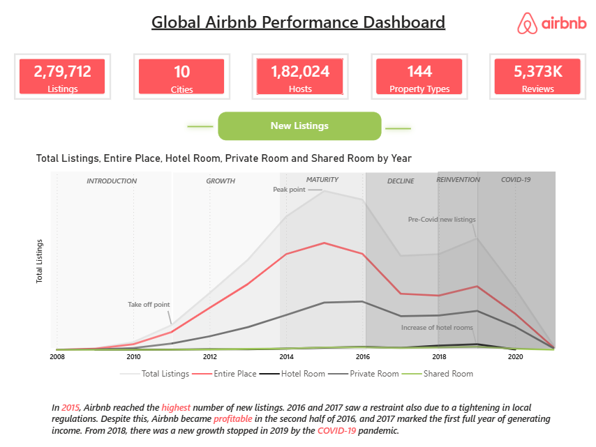
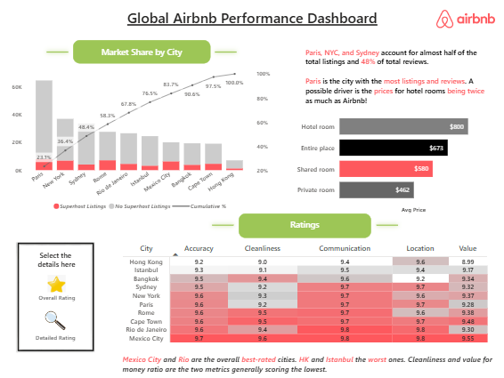
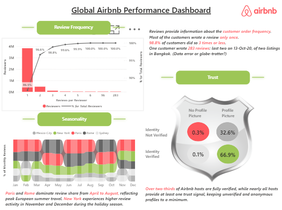

# Airbnb Dashboard

A multi-page interactive Power BI report designed to explore Airbnb listing data across cities — covering host behaviour, pricing, room types, guest ratings, and review patterns.

---

## Short Description

The Airbnb Analytics Dashboard is a structured, three-page Power BI report built to surface actionable insights from Airbnb listing and review data. It enables analysts, property managers, and platform strategists to understand how listings are distributed across cities, how guests rate their stays across multiple dimensions, and how review activity trends over time. The dashboard is designed to support decisions around host quality assessment, market competitiveness, and guest experience benchmarking.

---

## Tech Stack

The dashboard was built using the following tools and technologies:

- 📊 **Power BI Desktop** — Main data visualisation platform for report design and publishing.
- 📂 **Power Query** — Data transformation and cleaning layer used to reshape the Listings and Reviews tables.
- 🧠 **DAX (Data Analysis Expressions)** — Used extensively for calculated measures including cumulative rankings, percentage splits, conditional host segmentation, and dynamic review frequency distributions.
- 📐 **Data Modelling** — Relationships established between `Listings` and `Reviews` tables using `listing_id` as the key, with supporting `DateTable` templates for time intelligence.
- 📁 **File Format** — `.pbit` (Power BI Template) for portability and reuse across datasets.

---

## Data Source
## Dataset
[Download the Dataset](https://mavenanalytics.io/data-playground/airbnb-listings-reviews)

The dashboard is built on two core tables:

**Listings** — Contains property-level details for each Airbnb listing, including:
- **Host attributes:** `host_id`, `host_since`, `host_response_time`, `host_acceptance_rate`, `host_is_superhost`, `host_identity_verified`, `host_has_profile_pic`
- **Location:** `city`, `district`, `neighbourhood`, `latitude`, `longitude`
- **Property details:** `property_type`, `room_type`, `accommodates`, `bedrooms`, `amenities`, `price`, `minimum_nights`, `maximum_nights`, `instant_bookable`
- **Review scores:** `review_scores_rating`, `review_scores_accuracy`, `review_scores_cleanliness`, `review_scores_checkin`, `review_scores_communication`, `review_scores_location`, `review_scores_value`
**Reviews** — Contains guest review records linked to listings, including `listing_id`, `review_id`, `date`, `reviewer_id`, and derived fields for frequency analysis and monthly aggregation.

---

## Features & Highlights

### Business Problem

Airbnb hosts, property managers, and market analysts often struggle to make sense of large volumes of listing and review data scattered across cities. Key questions such as:

- Which cities have the most listings and how are they distributed by room type?
- How do ratings vary across cleanliness, location, and value dimensions?
- Are superhosts genuinely better rated?
- How frequently do reviewers return, and how has review activity changed over time?

...are difficult to answer at a glance without a structured visual tool.

### Goal of the Dashboard

To deliver an interactive, multi-page analytical report that enables users to:
- Benchmark listings and hosts across cities and room types.
- Evaluate guest satisfaction across six distinct rating dimensions.
- Understand review volume trends and reviewer loyalty patterns over time.

### Walkthrough of Key Pages & Visuals

**Page 1 — Overview**

High-level summary of the listings landscape — KPI cards for Total Listings, Total Hosts, Average Price, Superhost count, and Avg Rating. Includes a cumulative listings line chart by city and room type breakdowns.

**Page 2 — Ratings**

Drills into guest satisfaction across six review dimensions (Accuracy, Cleanliness, Check-in, Communication, Location, Value) via combo charts, bar charts, and a pivot table for side-by-side comparisons.

**Page 3 — Reviews**

Covers review volume trends, reviewer frequency distribution with cumulative %, and a ribbon chart tracking city-level review activity over time.

### Dashboard Pages Summary

| Page | Focus | Key Visual Types |
|---|---|---|
| Overview | Listings distribution, hosts, pricing, room types | KPI Cards, Line Chart, Combo Chart |
| Ratings | Guest satisfaction across 6 score dimensions | Bar Chart, Column Chart, Combo Chart, Pivot Table |
| Reviews | Review volume, reviewer behaviour, time trends | KPI Cards, Column Chart, Combo Chart, Ribbon Chart |

### Business Impact & Insights

- **Host Quality Assessment:** The trust segmentation and superhost measures help platform teams identify gaps between verified identity and actual listing quality.
- **Pricing Strategy:** Average price cards combined with city-level listing counts enable hosts to benchmark their pricing against the local market.
- **Guest Experience Improvement:** The six-dimension ratings breakdown pinpoints where hosts consistently fall short — whether in cleanliness, communication, or perceived value.
- **Market Trend Analysis:** The ribbon and monthly review charts help analysts track which cities are gaining traction and which are stagnating.
- **Reviewer Loyalty Modelling:** The cumulative review frequency chart reveals the concentration of reviews among a small pool of active reviewers — critical insight for trust and authenticity strategies.

---

## Screenshots

### Page 1 — Overview

### Page 2 — Ratings

### Page 3 — Reviews

